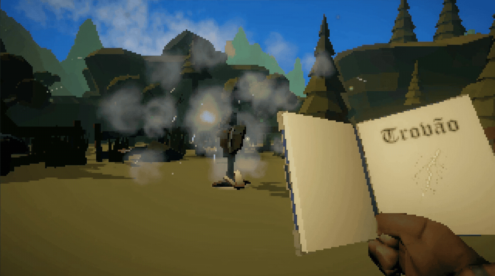

# 🧙‍♂️ Spell Caller  

**Spell Caller** é um protótipo desenvolvido na Unity com foco em experimentação de mecânicas que são ativadas a partir do reconhecimento de voz com palavras-chave.  

---

## 🎯 Objetivo do Projeto

Inspirado em jogos como **[Mage Arena](https://store.steampowered.com/app/3716600/Mage_Arena)**, o objetivo principal foi desenvolver um sistema de magias customizável onde o jogador tenha que ler o feitiço em voz alta para conjurá-lo. Além disso, o projeto é um exercício de arquitetura limpa e boas práticas de programação em Unity.

---

## 🧩 Tecnologias Utilizadas

- `Unity Engine (C#)`
- `Windows Speech Recognition API` – Sistema de **reconhecimento de voz nativo**, utilizando `KeywordRecognizer` para acionar magias com comandos falados.  
- `ScriptableObjects`– Armazenamento modular das magias (nome de conjuração, dano, intervalo, efeitos, informações na HUD).  
- `FMOD` – Sistema de áudio dinâmico (som ambiente, efeitos sonoros com variação lógica e espacial 3D).  
- `DOTween` – Aplicação de juiceness e feedbacks visuais (headbob, suavização física, animações na UI).  
- `Input System (New)` – Suporte a teclado e controle.  

---

## 📊 Status Atual

🔹 **Fase:** Base finalizada 

🔹 **Foco atual:** Demonstrar o resultado atingido com as conjunrações de magias

🔹 **Próximos passos:**  
- Build pública
- Implementação de novos feitiços e inimigos  

---

## 📦 Créditos de Assets

- **Nome do Asset** – Autor / Link   

---

## 👁️ Observação Final

Este projeto **não é comercial** e tem como finalidade **estudos e aperfeiçoamento de conhecimentos e boas práticas**.  

---
